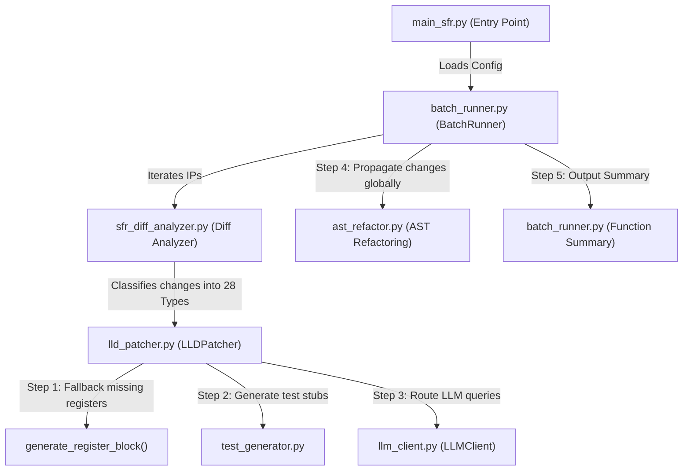

# SSRI LLD Auto-Patcher Execution Code Flow Guide

This document provides a detailed walkthrough of the execution code flow and architectural design of the **Samsung SSRI LLD Auto-Patcher**. It serves as a guide for engineering teams who need to understand, maintain, or customize the patching pipeline.

---

## 1. High-Level Architectural Flow

The pipeline operates in two major orchestration modes: **CLI Single-IP mode** and **Config-Driven Batch mode**. Below is the execution sequence:

---

## 2. Core Modules & Code Flow Details

### A. Diff Classification & Parsing
* **Module**: [lld_gen/sfr_diff_analyzer.py](file:///c:/Users/pavan/Desktop/cxl/sfr_gen/lld_gen/sfr_diff_analyzer.py)
* **Flow**:
  1. Parses the old and new `sfr.h` files into Intermediate Representation (`SfrIR`, `RegisterIR`, `FieldIR`) objects.
  2. Compares registers by offset, name, comment headers, and bit ranges.
  3. Returns a list of `ChangeRecord` objects with designated `ChangeType` classifiers (e.g. `REG_RENAMED`, `FIELD_ADDED`, `BITWIDTH_CHANGED`).

### B. LLDPatcher, Missing Register Fallback & Semantic LLD Generation
* **Module**: [lld_gen/lld_patcher.py](file:///c:/Users/pavan/Desktop/cxl/sfr_gen/lld_gen/lld_patcher.py)
* **Flow**:
  1. Reads the existing `lld.h` file and splits it into register-based blocks keyed by `SRC_SHA` comment anchors.
  2. **Missing Register Fallback**: It compares the changed registers list against the blocks parsed from the LLD file. If a changed register has no matching block in the LLD file, the patcher dynamically invokes `generate_register_block()` to construct the missing functions (getters/setters/clears) and appends the block to the LLD file.
  3. **Semantic LLD Function Generation**:
     - When a field is added (`FIELD_ADDED`), if the field change request requires LLM intervention (`needs_llm` is True) and the LLM client is configured, the patcher queries the LLM to generate custom semantic LLD functions.
     - The LLM analyzes the field access type and description (e.g., "(RW) 1: enable, 0: disable" or "(WO) trigger write transaction") to write tailored semantic actions like `lld_<ip>_<reg>_<field>_<verb>` (e.g., `lld_pmu_ctrl_dma_en_enable`).
     - If the LLM generates a function successfully, it is appended to the block. If it fails or is disabled, the system falls back to standard getter/setter templates.
  4. It applies modifications surgically per block. If a change requires semantic generation, it prepares prompts for the LLM.
  5. Collects and updates list of modified, added, and removed function signatures.

### C. LLM Routing & Dynamic Cloud Endpoint Overrides
* **Module**: [lld_gen/llm_client.py](file:///c:/Users/pavan/Desktop/cxl/sfr_gen/lld_gen/llm_client.py)
* **Flow**:
  1. `LLMClient` dynamically resolves configuration settings during initialization.
  2. If `location` is set to `"cloud"`, calls are routed to `_call_cloud_ollama`.
  3. **Custom URL & Model Resolution**:
     - Evaluates `self.cfg.url`. If it is custom (i.e. not empty and not the default `http://localhost:11434`), it targets the custom URL.
     - Automatically appends `/api/generate` to the URL path if the suffix is missing.
     - Evaluates `self.cfg.model`. If not empty or a local name, it overrides the default `gpt-oss` model name.
  4. Calls the cloud API with a single flattened `prompt` payload and returns the raw C block.

### D. AST Cross-Refactoring, C++ Preprocessing & Frozen Names
* **Module**: [lld_gen/ast_refactor.py](file:///c:/Users/pavan/Desktop/cxl/sfr_gen/lld_gen/ast_refactor.py)
* **Flow**:
  1. Scans the LLD scan folders recursively for C/C++ files (`*.c`, `*.h`, `*.cpp`).
  2. Extracts all local typedef declarators (including hardware structs/unions) dynamically to construct symbol table definitions.
  3. **C++ Preprocessing & Stripping (In-Memory)**:
     - Strips C++ `extern "C" { ... }` blocks using a stack-based brace-matching scanner to replace braces/linkages with spaces, ensuring position alignment.
     - Strips class/struct access specifiers (`public:`, `private:`, `protected:`) using regex replacements.
     - Strips struct member initializers (e.g. `= {0x0000000}`) to prevent pycparser parsing errors, while maintaining exact coordinates.
  4. Pre-processes code by commenting preprocessors (`#`) and stripping compiler-specific keywords (like `__attribute__`) to prevent parse errors.
  5. Parses source code into a C AST using `pycparser`.
  6. Traverses AST looking for member access paths referencing the modified structures.
  7. **Frozen Function Names**: Disables LLD function renames (returns empty mapping in `get_function_renames`), keeping driver calls intact while successfully updating only the struct member access bodies (e.g. `pSFR->stPMU_CON` becomes `pSFR->stPMU_CTRL`).
  8. Reconstructs lines in-place without shifting columns or breaking line positions.

### E. End-of-Run File-Level Summary
* **Module**: [lld_gen/batch_runner.py](file:///c:/Users/pavan/Desktop/cxl/sfr_gen/lld_gen/batch_runner.py)
* **Flow**:
  1. Tracks LLD function changes (`_added_fns`, `_patched_fns`, `_removed_fns`) per file during the patching loop.
  2. At the end of the batch run, prints a structured list of exact functions added/patched/removed per LLD file in the `FILE-LEVEL LLD FUNCTION PATCH SUMMARY` table.

---

## 3. How to Customize the Code

If you need to tweak the behavior of the auto-patcher, here are the exact entry points:

| Customization Goal | File to Modify | Target Code / Location |
| :--- | :--- | :--- |
| **Change LLM prompts** | [lld_gen/llm_client.py](file:///c:/Users/pavan/Desktop/cxl/sfr_gen/lld_gen/llm_client.py) | Modify prompt templates under the cloud or local endpoint callers. |
| **Add new custom C types for AST** | [lld_gen/ast_refactor.py](file:///c:/Users/pavan/Desktop/cxl/sfr_gen/lld_gen/ast_refactor.py) | Append new types to `STANDARD_TYPEDEFS` or expand regex rules. |
| **Change default cloud defaults** | [lld_gen/llm_client.py](file:///c:/Users/pavan/Desktop/cxl/sfr_gen/lld_gen/llm_client.py) | Edit the fallbacks inside `_call_cloud_ollama()`. |
| **Adjust change classifiers** | [lld_gen/sfr_diff_analyzer.py](file:///c:/Users/pavan/Desktop/cxl/sfr_gen/lld_gen/sfr_diff_analyzer.py) | Tweak priority sorting rules in `classify_field_change()`. |
| **Tweak generated function headers** | [lld_gen/lld_patcher.py](file:///c:/Users/pavan/Desktop/cxl/sfr_gen/lld_gen/lld_patcher.py) | Modify the template generators `_getter()`, `_setter()`, or `_w1c_clear()`. |
| **Adjust C++ Preprocessing Rules** | [lld_gen/ast_refactor.py](file:///c:/Users/pavan/Desktop/cxl/sfr_gen/lld_gen/ast_refactor.py) | Edit `strip_extern_c()` and `strip_cpp_features()` helpers. |
| **Tune Semantic Function Prompting** | [lld_gen/llm_client.py](file:///c:/Users/pavan/Desktop/cxl/sfr_gen/lld_gen/llm_client.py) | Adjust `_LLD_NEW_FN_SYSTEM` system instruction prompt for semantic generation. |
