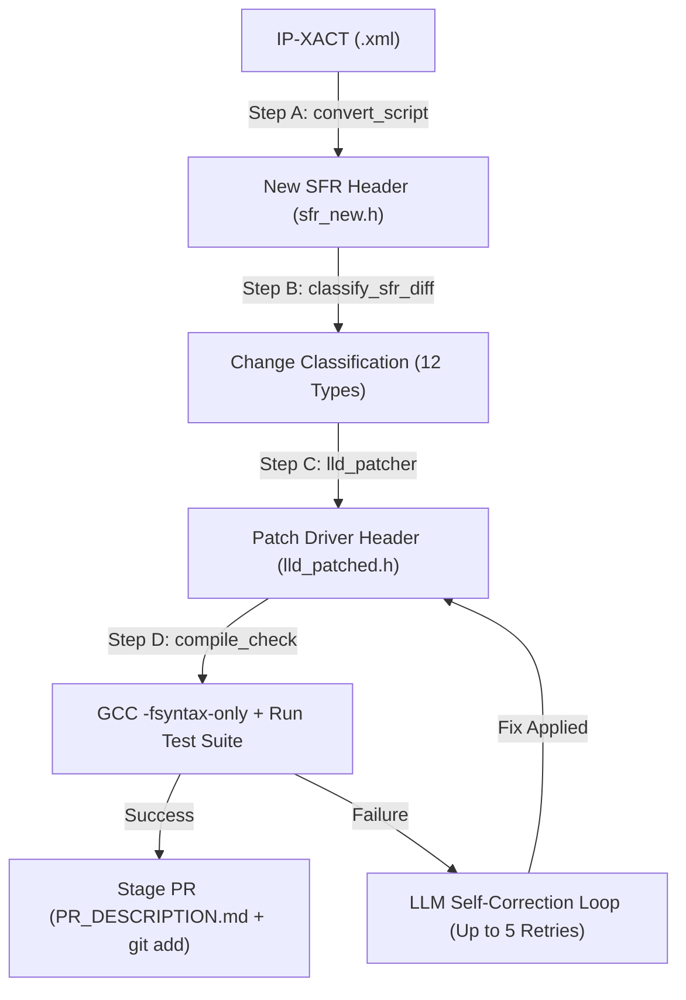

# LLD Auto-Patcher Orchestration Pipeline — User & Customer Guide

Welcome to the **Samsung SSRI LLD Auto-Patcher** user guide. This document outlines how to install, configure, and operate the automated pipeline that translates SFR register changes into Low-Level Driver (LLD) C code.

---

## 1. System Overview & Architecture

The LLD Auto-Patcher is designed to bridge the gap between Hardware Register Definitions (IP-XACT XML or SFR Header files) and Low-Level Driver (LLD) source files. It processes register map revisions, automatically updates getter/setter/clear routines, compiles and runs native unit tests, and stages pull requests.



---

## 2. Prerequisites & Environment Setup

Before running the pipeline, ensure the following dependencies are installed and set up.

### Python Environment
* Python 3.11 or higher.
* Install dependencies:
  ```bash
  pip install -r requirements.txt
  ```

### Native GCC Compiler
A native GCC compiler is required to run syntax checks and execute functional test assertions.
* **Windows (Recommended)**:
  Run the following command in PowerShell to install **WinLibs MinGW-w64**:
  ```powershell
  winget install BrechtSanders.WinLibs.POSIX.UCRT --accept-source-agreements --accept-package-agreements
  ```
  *Note: Make sure to copy the path to the extracted `gcc.exe` (usually under `AppData/Local/Microsoft/WinGet/Packages/.../mingw64/bin/gcc.exe`) to update your configuration files.*
* **Linux (Ubuntu/Debian)**:
  ```bash
  sudo apt update && sudo apt install build-essential gcc -y
  ```
* **macOS**:
  ```bash
  brew install gcc
  ```

### LLM Backends (Choose One)
* **Local Backend (Ollama)**: Zero-cost, local inference.
  1. Download and run [Ollama](https://ollama.com).
  2. Pull the recommended coding model:
     ```bash
     ollama pull qwen2.5-coder:1.5b
     ```
* **Cloud Ollama Backend (Dedicated remote server)**: High-performance shared endpoint.
  1. Point the `url` to the dedicated cloud/internal Ollama server address.
  2. Set `location: "cloud"` in your configuration file.
* **Cloud Backend (HuggingFace Inference API)**:
  1. Obtain an API token from your HuggingFace account profile settings.
  2. Export it as an environment variable:
     ```bash
     export HF_TOKEN="hf_your_token_here"
     ```

---

## 3. Register Comment Invariants

The parser relies on **Structured Comments** in the SFR `.h` files to interpret access permissions and descriptions. Every register field must have a comment format exactly matching this pattern:

```c
/* FIELDNAME [MSB:LSB] ACCESS — Description */
#define PERIPH_REG_FIELDNAME_MASK   0x000000XXU
#define PERIPH_REG_FIELDNAME_SHIFT  XU
```

### Access Modifiers
* **`RO`**: Read-Only (Generates getter function only)
* **`WO`**: Write-Only (Generates setter function only)
* **`RW`**: Read-Write (Generates getter and setter functions)
* **`W1C`**: Write-1-to-Clear (Generates getter and clear functions)
* **`W1S`**: Write-1-to-Set (Generates getter and set functions)

---

## 4. Configuration Management

Configuration is handled using YAML files (`lld_patcher.yaml` or `workflow_config.yaml`). Below is a complete guide to all available parameters with descriptions and examples:

```yaml
# =============================================================================
# 4.1 Directories
# =============================================================================
sfr_old_dir: "./old_sfr"          # Folder containing original SFR headers
sfr_new_dir: "./new_sfr"          # Folder containing updated SFR headers
lld_dir:     "./lld"              # Folder containing existing driver files
output_dir:  "./lld_patched"      # Folder where patched LLD headers are written
tests_dir:   "./tests_generated"  # Folder where functional test C files are written

# =============================================================================
# 4.2 LLM Settings & Gating
# =============================================================================
no_llm:       false               # true = Disable LLM patching; use templates/flag manual review
debug_llm:    false               # true = Print raw prompts & LLM responses to stdout for debugging
llm:
  backend:     "ollama"           # LLM Backend: ollama | huggingface | openai | anthropic
  model:       "qwen2.5-coder:7b" # Model identifier (e.g. qwen2.5-coder:7b or gpt-4o-mini)
  url:         "http://localhost:11434" # Custom backend url (optional)
  location:    "local"            # local | cloud (e.g., set to cloud for remote servers)
  api_key:     ""                 # API key / HuggingFace Token (or use env HF_TOKEN)
  temperature: 0.1                # low temperature (0.0-0.2) ensures deterministic C code
  max_tokens:  600                # Token budget per function patch query

# Example Cloud Ollama Configuration:
# llm:
#   backend:   "ollama"
#   model:     "gpt-oss"
#   url:       "http://107.99.41.85/ollama/srv1/api/generate"
#   location:  "cloud"

# Gating Thresholds:
# Ratio (SequenceMatcher) of old vs new description text:
#  - Below low threshold (default 0.75): Auto-patch directly via LLM.
#  - Above high threshold (default 0.85): Auto-skip as cosmetic (no code patch needed).
#  - In-between (0.75 - 0.85): Call LLM to confirm if semantic change exists.
semantic_similarity_threshold_low:  0.75
semantic_similarity_threshold_high: 0.85

# =============================================================================
# 4.3 Compiler Settings & Self-Correction
# =============================================================================
gcc: null                         # Path to gcc binary (null = search system PATH)
compile_check: true               # true = Stop pipeline if gcc compiler is not found
per_fn_compile: true              # true = Run gcc compile check after every single patched function
max_llm_retries: 5                # Number of compiler self-correction retry loops on syntax failure

# =============================================================================
# 4.4 Patching & Refactoring Rules
# =============================================================================
generate_new_functions: true      # true = Generate templates for newly added fields (FIELD_ADDED)
skip_reg_added:   true            # true = Flag REG_ADDED registers for manual review (recommended)
skip_reg_deleted: true            # true = Flag REG_DELETED registers for manual review (recommended)
cross_lld_scan:   true            # true = Scan directories for other files containing modified refs
lld_search_depth: 3               # Directory search depth limit for cross-file scan

# =============================================================================
# 4.5 Git & PR Automation
# =============================================================================
no_git:           false           # false = Stage modifications & write PR_DESCRIPTION.md
github_url: ""                    # Remote repo URL (autodetected from origin if empty)
```


### 4.1 Key Operational Modes: GCC & LLM Configurations

You can adapt the pipeline's behavior depending on compiler availability or backend connectivity by tweaking these parameters:

#### A. Compilation Check Options (GCC Gate)
* **Mandatory Mode (`compile_check: true`)**: 
  Requires GCC to be installed and accessible. If the compiler is not found, the pipeline halts immediately with a `GCC NOT FOUND -- PIPELINE STOPPED` error to prevent untested code from being staged.
* **Skip/Warning Mode (`compile_check: false`)**:
  Allows you to run the pipeline without a local GCC installation. It will still attempt to find a compiler to run optional syntax checks, but if one is not found, it will gracefully skip compiling and execution testing and proceed directly to staging the PR.

#### B. Driver Generation Modes (LLM vs Template-only)
* **LLM Auto-Patching (`no_llm: false`)**:
  Enables the pipeline to query local Ollama or cloud HuggingFace models for complex code generation, custom comments, or advanced field actions.
* **Template-only Mode (`no_llm: true`)**:
  Runs the pipeline purely offline and deterministically without making any LLM requests. It uses code generation templates to patch simple renames/bit-widths. Any changes requiring semantic interpretation (such as description updates or complex access mode changes) are automatically skipped and flagged for **Manual Review** in the pull request description.

---

## 5. Usage Commands (Step-by-Step)

The entry point for the pipeline is `lld_gen.main_sfr`. Execute commands from the `sfr_gen` workspace root directory.

### Mode A: Batch Run (Config-Driven)
Recommended for processing multiple IP blocks at once using a configuration file:
```bash
python -X utf8 -m lld_gen.main_sfr run-config --config lld_patcher.yaml
```

### Mode B: Single IP Run (All-in-One Command)
Runs the complete workflow (diff -> patch -> compile-check -> stage) for a single IP block:
```bash
python -m lld_gen.main_sfr run \
    --old old_sfr/sfr_pmu.h \
    --new new_sfr/sfr_pmu.h \
    --lld lld/lld_pmu.h \
    --ip PMU \
    --gcc "C:/path/to/gcc.exe"
```

### Mode C: Granular Step Execution
You can execute each phase of the pipeline manually:

1. **Step 1: Classify Differences**
   Compare the old and new headers and generate a change log:
   ```bash
   python -m lld_gen.main_sfr diff --old old.h --new new.h --ip PMU --classify-out changes.json
   ```
2. **Step 2: Apply Patches**
   Patch the LLD driver file surgically based on classification:
   ```bash
   python -m lld_gen.main_sfr patch --changes changes.json --lld lld.h --sfr-new new.h --ip PMU
   ```
3. **Step 3: Compile Verification**
   Verify the patched driver compiles cleanly:
   ```bash
   python -m lld_gen.main_sfr compile-check --sfr new.h --lld lld.h --tests test_file.c
   ```
4. **Step 4: PR Staging**
   Generate documentation and run `git add`:
   ```bash
   python -m lld_gen.main_sfr stage --old-sfr old.h --new-sfr new.h --lld lld.h --ip PMU
   ```

---

## 6. Self-Correction & Verification Loop

When the pipeline runs:
1. **Patching**: For non-trivial changes (such as access mode modifications or documentation changes), the patcher inserts driver templates or prompts the LLM.
2. **Functional Test Generation**: The pipeline writes a test harness containing assertion cases covering every register field.
3. **GCC Syntax Check**: It compiles the test suite using:
   `gcc -fsyntax-only`
4. **Self-Healing Loop**: If a compilation error is encountered:
   * The compiler error message and the offending function are isolated.
   * A targeted prompt is sent to the LLM to rewrite the function.
   * The patched code is compiled again. This repeats up to **5 times** before falling back to manual review.
5. **Execution Check**: Once compilation succeeds, it builds and runs `test_lld_<ip>.exe` natively, asserting correct bitfield operations and memory layout.

---

## 7. Staged PR Review

After a successful run, the tool:
* Runs `git add` for the modified files.
* Writes a **`PR_DESCRIPTION.md`** file in the output directory.
* Flags items requiring manual attention under `### Manual Review Required` (e.g., deleted registers that have external callers, or registers added that require new user logic).

Before submitting a Pull Request, review the generated checklist in `PR_DESCRIPTION.md` and complete any manual review tasks.
